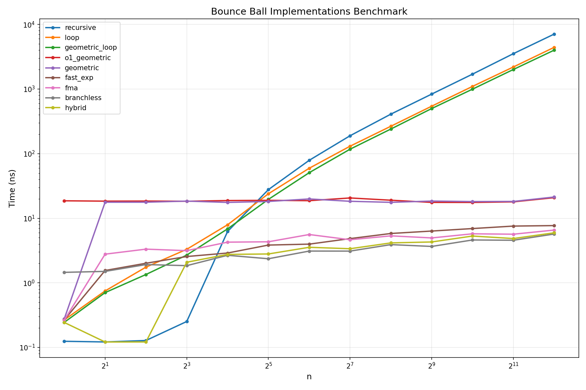

# Bouncing Ball Distance Calculator

Optimizing a simple interview problem to the extreme.

## Problem Statement

Calculate the total distance traveled by a bouncing ball in `n` bounces.

- Ball drops from height `h`
- Each bounce loses height by factor `r`
- First bounce: just drops from `h` → distance = `h`
- Second bounce: drops `h`, bounces up `h*r`, falls `h*r` → distance = `h + 2hr`
- Third bounce: adds another up/down of `h*r²` → distance = `h + 2hr + 2hr²`

General formula:
```
f(n) = h + 2hr + 2hr² + ... + 2hr^(n-1)
= h * (1 + r - 2r^n) / (1 - r)    for r ≠ 1
= h * (2n - 1)                     for r = 1
```

## Implementations

| Function | Complexity | Description |
|----------|------------|-------------|
| `bounce_recursive` | O(n) | Original interview solution |
| `bounce_loop` | O(n) | Simple iterative version |
| `bounce_geometric_loop` | O(n) | Loop computing geometric series |
| `bounce_o1_geometric` | O(1) | Closed-form with `std::pow` |
| `bounce_geometric` | O(1) | Closed-form with `std::pow` |
| `bounce_fast_exp` | O(log n) | Binary exponentiation |
| `bounce_fma` | O(log n) | FMA-optimized binary exp |
| `bounce_branchless` | O(log n) | Branchless with safe division |
| `bounce_hybrid` | O(log n) | Unrolled small n + closed-form fallback |

## Building

```bash
cmake --preset release-vcpkg
cmake --build --preset release-vcpkg
```

## Running Tests

```bash
./build/release-vcpkg/tests/tests
```

## Running Benchmarks

```bash
./build/release-vcpkg/bench/bench --benchmark_out=results.json --benchmark_out_format=json
```

## Plotting Results

```bash
python plot_bench.py results.json
```

## Results

The O(n) implementations (recursive, loop) scale linearly while the closed-form solutions remain nearly constant regardless of `n`. For large `n`, the optimized versions are orders of magnitude faster.


